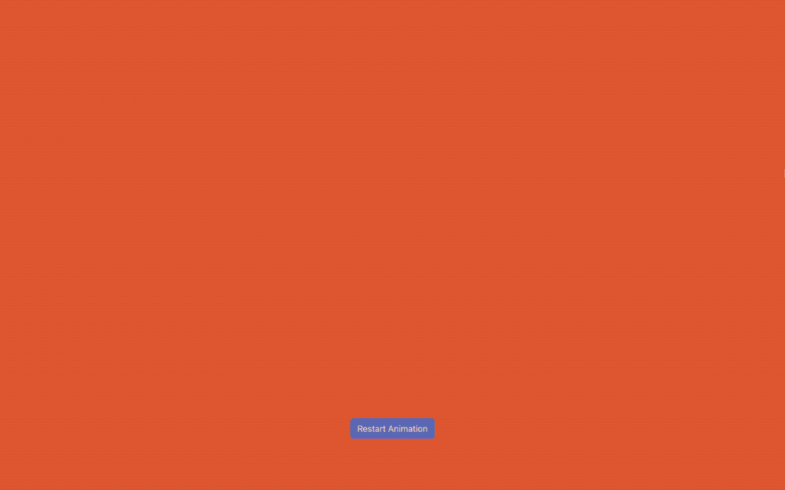

# Vivus Text Animation



## Table of Contents
- [Overview](#overview)
- [Demo](#demo)
- [Features](#features)
- [Installation](#installation)
- [Usage](#usage)
- [Contributing](#contributing)
- [Acknowledgments](#acknowledgments)
- [License](#license)
- [Author](#author)

## Overview
This project showcases an SVG text animation using Vivus library. It provides a captivating way to animate text on web pages, adding an interactive and dynamic element to the user experience.

## Demo
Check out the live demo on [CodePen](https://codepen.io/karlhorning/pen/OJqoKoO).

## Features
- SVG animation with Vivus library.
- Engaging text effects for enhanced user experience.
- Easily customizable animation parameters.

## Installation
To use this project locally, you can clone the GitHub repository:

```bash
git clone https://github.com/Karl-Horning/vivus-text-animation.git
```

## Usage
Simply include the necessary files in your project and initialize the animation script. Refer to the documentation in the script.js file for detailed instructions on usage.

## Contributing
Contributions are welcome! Please follow these guidelines:
1. Fork the repository.
2. Create a new branch for your feature: `git checkout -b feature-name`.
3. Make your changes and commit them: `git commit -m 'Add feature'`.
4. Push to the branch: `git push origin feature-name`.
5. Submit a pull request.

## Acknowledgments
- [Bootstrap](https://getbootstrap.com)
- [Don Graffiti font](https://www.dafont.com/don-graffiti.font)
- [Vivus](https://github.com/maxwellito/vivus)

## License
This project is licensed under the MIT License - see the [LICENSE](LICENSE) file for details.

## Author
**Karl Horning:**
- [Portfolio](https://karl-horning.github.io)
- [GitHub](https://github.com/Karl-Horning/)
- [LinkedIn](https://www.linkedin.com/in/karl-horning/)
- [CodePen](https://codepen.io/karlhorning)